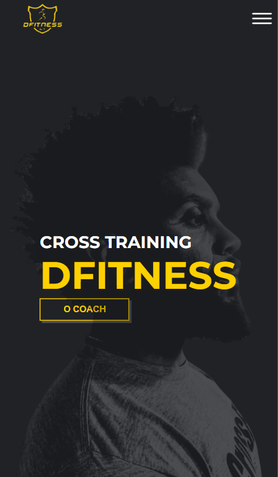
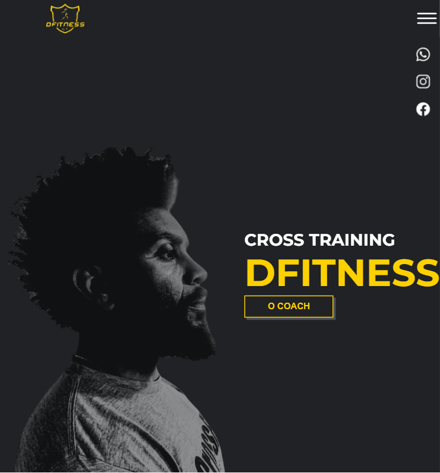
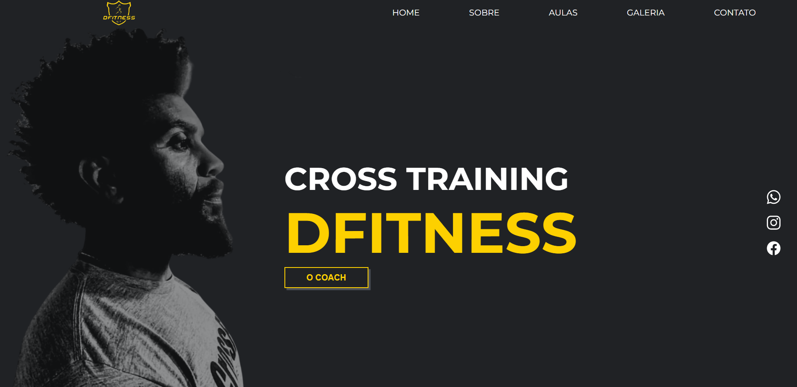

## 📖 Introdução 

Esta é uma Landing Page construida para a academia de Cross Training DFitness localizada no Capão Redondo-SP, com objetivo de promover o espaço de treinamento ao publico da região que buscam novas práticas esportivas.

## 🔗Link de Acesso
- Deploy Github Pages: [clique aqui!](https://danielemidio1988.github.io/Dfitness/).

## 👥Equipe
| [<br><sub>Daniel Emidio</sub>](https://github.com/DanielEmidio1988) |
| :---: |

## 🧭Status do Projeto
- ⏳Concluído

## 📄Concepção do Projeto

### Layout Mobile

| <br><sub>Home</sub> | 
| :---: | 

### Layout Tablet

| <br><sub>Home</sub> | 
| :---: | 

### Layout Desktop

| <br><sub>Home</sub> | 
| :---: | 

### Funcionalidades
```bash
. Responsividade: Aplicação totalmente responsiva para Desktop, Tablet e Celulares;
```


## 💡Programas utilizados:
- VSCode

## 💻Tecnologias 


## 📫 Contato

E-mail: emidio.daniel@hotmail.com

[](https://www.linkedin.com/in/danielemidio1988/)
[](https://www.codewars.com/users/DanielEmidio1988)